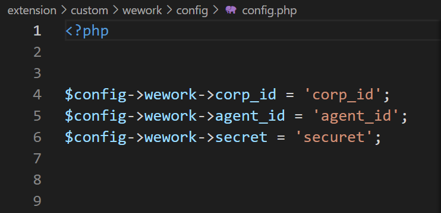
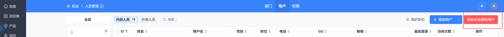

### 简介

将企业微信应用用户直接同步到禅道并创建禅道的用户

创建禅道用户后可使用企业微信直接扫码登陆

在禅道开源版20stable中验证

### 使用方式
- 1.将代码解压至禅道对应目录
- 2.修改 `extension/custom/wework/config/config.php` 中的企业微信应用配置

  

- 3.在禅道后台人员管理中点击按钮`同步企业微信用户`

  

### 备注
- 1.同步后的用户就是禅道系统的用户，可以直接使用账号密码登录
- 2.如果想要控制同步的用户，请在企业微信后台修改应用可见范围
- 3.请记得在企业微信后台设置回调和可信IP

### 关于官方的webhook插件

禅道使用的消息通知webhook使用的就是企业微信的用户ID

本插件创建用户的`account`字段也是用户ID，所以直接绑定用户到webhook后就可以进行消息推送

- 1.在禅道后台创建webhook,类型为`企业微信应用消息`
- 2.保存后查看webhook的ID,例如ID为:`1`
- 3.直接在url中输入`/zentao/wework-bind.html?webhookID=1`调用本插件中的bind方法，将所有用户的account直接绑定到webhook
- 4.如果出现异常，那还是手动去选择进行绑定吧....